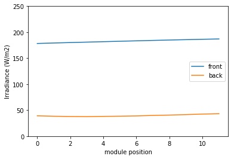

.. Bifacial Illumination documentation master file, created by
   sphinx-quickstart on Mon Jan  6 17:54:26 2020.
   You can adapt this file completely to your liking, but it should at least
   contain the root `toctree` directive.

.. image:: https://readthedocs.org/projects/bifacial-illumination/badge/?version=latest
    :target: https://bifacial-illumination.readthedocs.io/en/latest/?badge=latest
    :alt: Documentation Status

Welcome to Bifacial Illumination's documentation!
=================================================

Bifacial Illumination is a simple tool to evaluate illumination on front and back side in solar arrays. It assumes endless dimensions of the PV field. It was designed for fast evaluation of timeseries and tmy data of solar radiation. It also includes functionality to optimize the module tilt and the spacing between rows with a very simple cost model.

Installation
____________

For installation you need to clone the project from github, then you can install it with pip.

.. code-block:: console

    git clone https://github.com/nano-sippe/bifacial_illumination
    cd bifacial_illumination
    pip install bifacial_illumination

Getting Started
_______________

You can define the parameters of the PV field and the position of the sun to evaluate front and back illumination. Results are an 1d array (for different positions on the module) if a single sun position is modeled.

.. ipython::
    :verbatim:

    In [2]: input_dict = dict(module_length=1.96, module_tilt=52,
       ...:                   mount_height=0.5, module_spacing=7.3,
       ...:                   dni=100, dhi=120, zenith_sun=60,
       ...:                   azimuth_sun=143.3, albedo=0.3)
       ...:
       ...: model = ModuleIllumination(**input_dict)
       ...: fig = plt.subplot()
       ...: fig.plot(model.results['irradiance_module_front'], label='front')
       ...: fig.plot(model.results['irradiance_module_back'], label='back')
       ...: fig.set_ylim(0,250)
       ...: fig.set_xlabel('module position')
       ...: fig.set_ylabel('Irradiance (W/m2)')
       ...: plt.legend(loc="right")

.. .. ipython:: python

    input_dict = dict(module_length=1.96, module_tilt=52,
                      mount_height=0.5, module_spacing=7.3,
                      dni=100, dhi=120, zenith_sun=60,
                      azimuth_sun=143.3, albedo=0.3)

    model = ModuleIllumination(**input_dict)
    fig = plt.subplot()
    fig.plot(model.results['irradiance_module_front'], label='front')
    fig.plot(model.results['irradiance_module_back'], label='back')
    fig.set_ylim(0, 250)
    fig.set_xlabel('module position')
    fig.set_ylabel('Irradiance (W/m2)')
    plt.legend(loc="right")

.. ipython::

   In [136]: x = 2

   In [137]: x**3
   Out[137]: 8

Getting radiation data
______________________

:doc:`From copernicus <copernicus>`
:doc:`With nsrdb <nsrdb>`

.. toctree::
   :maxdepth: 2
   :hidden:
   :caption: Getting radiation data

   copernicus
   nsrdb

Analyse timeseries and tmy data
_______________________________

:doc:`From copernicus <copernicus>`
:doc:`With nsrdb <nsrdb>`

.. toctree::
   :maxdepth: 2
   :hidden:
   :caption: Analyse timeseries

   calc_yield

.. toctree::
   :maxdepth: 2
   :hidden:
   :caption: Optimize yield

   optimize

.. toctree::
    :maxdepth: 2
    :caption: Contents:

Indices and tables
==================

* :ref:`genindex`
* :ref:`modindex`
* :ref:`search`
